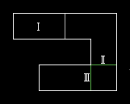

Двигающиеся потолки. Давилки.
===============

Использование.
--------

Когда линия с таким типом активируется, потолок изменяет своё положение в пространстве (z), короче, двигается. Если он опускается и под него в это время попадает посторонний обьект (игрок, монстр), он просто останавливается (попавший туда обьект не может двигаться), а когда обьект оттуда уходит, он возобновляет движение. "Давилка" - потолок, который после попадания под него постороннего, не останавливается, а продолжает двигатся дальше, нанося ущерб здоровью обьекта, Такие потолки не останавливаются. Они двигаются вниз, и, достигнув нужной высоты, двигаются вверх - обратно. Достигнув начальной высоты, они снова начинают двигаться вниз. И Так до бесконечности.

I - сектор 1, давилка - прямоугольник из 4 линий. Всё остальное - сектор 2. II - линия с типом WR Slow Crusher Ceiling, III - линия с типом WR Stop Crusher Ceiling. Принцип работы давилок - игрок идёт, натыкается на триггер II - давилка начинает работу. Потом игрок уходит, и, натыкается на триггер III - давилка замирает на месте. Остановка давилки нужна была, чтобы не занимать память. Давилки, в основном издают звуки. Так что когда игрок видит давилку, она работает, когда не видит, не работает. При создании уровней не забудьте поставить верхнюю текстуру линии, разделяющей давилку от другого сектора. Для красоты поставте LowerUnpeg другим трём линиям.

Типы потолков.
--------

+-------------------------------------+---------+-------------------------------------------------------------------------------------------------------------------------------+
|              Название               |  Номер  |                                                                 Описание                                                      |
+=====================================+=========+===============================================================================================================================+
| Raise Ceil To Highest Adjacent Ceil |    40   | Потолок поднимается до высоты самого высокого рядом стоящего сектора                                                          |
+-------------------------------------+---------+-------------------------------------------------------------------------------------------------------------------------------+
| Lower Ceil To Floor                 | 41 / 43 | Потолок опускается до высоты пола данного сектора                                                                             |
+-------------------------------------+---------+-------------------------------------------------------------------------------------------------------------------------------+
| Lower Ceil 8 Above Floor            | 44 / 72 | Потолок опускается до высоты пола данного сектора + 8 (останавливается на расстоянии 8 до пола)                               |
+-------------------------------------+---------+-------------------------------------------------------------------------------------------------------------------------------+
| Fast Crusher Ceiling                |  6 / 78 | Активировать быструю давилку (не замедляется, когда попадает обьект, есть шанс выжить)                                        |
+-------------------------------------+---------+-------------------------------------------------------------------------------------------------------------------------------+
| Slow Crusher Ceiling                | 25 / 73 | Активировать медленную давилку (когда кто - то попадает, замедляет своё действие, в итоге обьект получает больше повреждений) |
+-------------------------------------+---------+-------------------------------------------------------------------------------------------------------------------------------+
| Slow Crusher Ceiling 8 Above Floor  |    49   | То же, что и предыдущее, только давилка не будет доезжать до пола (на расстоянии 8 от пола остановиться и пойдёт обратно)     |
+-------------------------------------+---------+-------------------------------------------------------------------------------------------------------------------------------+
| Silent Slow Crusher Ceiling         |   141   | Активировать медленную давилку ,бесшумную. Звука движения не будет, только звуки остановки                                    |
+-------------------------------------+---------+-------------------------------------------------------------------------------------------------------------------------------+
| Stop Crusher Ceiling                | 57 / 74 | Остановить давилку                                                                                                            |
+-------------------------------------+---------+-------------------------------------------------------------------------------------------------------------------------------+

