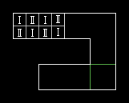
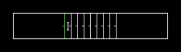
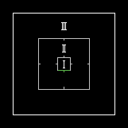

Двигающиеся полы
===============

Разновидности и использование
--------

Двигающиеся полы работают также, как и двигающиеся потолки. Тем, кто не читал, советую прочесть предыдущую тему. Существуют полы - давилки. Разница между ними - зажатый игрок может выскочить оттуда. Также такая давилка, доезжая до потолка, перекращает движение и останавливается, поэтому линий, останавливающих давилку, нет.

А вот на это стоит взглянуть. На рисунке снизу вместо того сектора с давилкой, я разместил 8 разных секторов, помеченные I - те, у которых высота -64, II - те, у кого высота 0. Расположены они в шахматном порядке. Есть, как у давилок, линия, активирующая движение, и прекращающая. При построении уровня необходимо поставить нижнии текстуры. А вот Upper или LowerUnpeg лучше не ставить.

Существуют "выдвижные" лесницы. На рисунке снизу два больших сектора - по бокам и 8 маленьких в середине. Большой слева - высота пола 0, высота потолка 128. Сектор слева - высота пола 128, потолка 256. Маленькие сектора: высота пола 0, высота потолка 256. Просто так из левого в правый сектор не проберёшся. Но когда игрок пересекает линию с типом W1 Raise Stairs Fast 16, появляется лестница со ступеньками высотой 16 каждая. Чтобы создать лестницу надо: задать тип линии с тагом x, таг x прописать определённому ОДНОМУ сектору (на рисунке помечен I), остальные будущие ступеньки не должны иметь этого тага. Дальше надо расположить линии, чтоб их главные стороны смотрели в сторону самой низшей ступеньки (показано на рисунке). При построении уровня не забудьте поставить нижние текстуры.

Также линия имеет лицевую и обратную стороны. Определить лицевую сторону линии можно по короткой перепендикулярной линии, выступающей из середины.

Есть ещё одна фишка. На рисунках снизу изображены столб, килота вокруг него. Столб - сектор, помеченный I, кислота - II, внешний сектор - III. Есть линия с типом S1 Lower Pillar, Raise Donut txt/type. Сектор I: выстота пола 104, потолка 512. Сектор II: высота пола -24, потолка 512. Сектор III: высота пола 0, потолка 512. Что происходит: высота пола сектора I становится такой - же, как у сектора 3. Высота пола сектора II тоже становится такой - же, но также текстура пола становятся идентичными с сектором III. Тип сектора II становится равен 0. Вот так вот. Важно направление главных сторон у линий: у сектора I они повёрнуты к сектору II, у сектора II они повёрнуты к сектору II (смотрите на рисунке). При построении уровня не обязательно ставить активирующую линию на столбе, её можно поставить куда угодно.

.. image:: map_doom_floor_02.jpeg

.. image:: map_doom_floor_03.jpeg

Типы двигающихся полов
-------------

.. list-table:: 
   :widths: 15 10 30
   :header-rows: 1
   
   * - Название
     - Номер
     - Описание
   * - Lower Floor To Highest Adjacent Floor
     - 19 / 45 / 81 / 102
     - Опустить пол данного сектора до высоты пола самого высокого ближнего сектора (именно опустить, так что пол ближнего сектора должен быть ниже данного).
   * - Lower Floor To Lowest Adjacent Floor
     - 23 / 38 / 60 / 82
     - Опустить пол данного сектора до высоты пола самого низкого ближнего сектора.
   * - Raise Floor To Match Next Highest Floor
     - 18 / 69 / 119 / 128
     - Поднять высоту пола сектора до следующей высоты пола сектора (именно поднять, так что пол не должен быть ниже данного).
   * - Raise Floor Fast To Match Next Highest Floor
     - 129 / 130 / 131 / 132
     - Поднять высоту пола сектора (быстро) до следующей высоты пола сектора.
   * - Lower Floor To 8 Above Highest Adjacent Floor
     - 36 / 70 / 71 / 98
     - Опустить пол данного сектора до высоты пола самого высокого ближнего сектора, не доезжая до него расстояние, равное 8.
   * - Raise Floor 24 Match Adjacent
     - 58 / 92
     - Поднять высоту пола сектора до следующей высоты пола сектора, и "проехать" мимо (выше) на расстояние, равное 24.
   * - Raise Floor 512 Match Adjacent
     - 140
     - Аналогично предыдущему, но проезжает пол до 512
   * - Raise Floor To Lowest Adjacent Ceiling
     - 5 / 24 / 64 / 91 / 101
     - Поднять высоту пола сектора до высоты ближнего сектора с самым низким потолком.
   * - Raise Floor By shortest Lower Txt
     - 30 / 96
     - Поднять высоту пола сектора на высоту самой короткой нижней текстуры у активирующей линии (пример - нижние текстуры линии - на одной стороне высота текстуры 64, на другой 128, высота пола будет больше на 64).
   * - Lower Floor To Lowest Adjacent Floor txt/type
     - 37 / 84
     - Опустить пол данного сектора до высоты пола самого низкого ближнего сектора, сменить текстуру на ту, что у другого сектора, сменить тип у данного сектора на 0.
   * - Raise Floor To Next Highes Floor txt/type
     - 20 / 22 / 47 / 68 / 95
     - Поднять высоту пола сектора до следующей высоты пола сектора, сменить текстуру на ту, что у другого сектора, сменить тип у данного сектора на 0.
   * - Raise Floor 24 Match Adjacent txt/type
     - 15 / 59 / 66 / 93
     - Поднять высоту пола сектора до следующей высоты пола сектора, и "проехать" мимо (выше) на расстояние, равное 24, сменить текстуру на ту, что у другого сектора, сменить тип у данного сектора на 0.
   * - Crusher Floor Raise 8 Below Ceiling
     - 55 / 56 / 65 / 94
     - Пол - давилка. Не доезжает до потолка расстояние, равное 8.
   * - Start Moving Floor
     - 53 / 87
     - Активировать пол, постоянно движущийся в случайном направлении.
   * - Stop Moving Floor
     - 54 / 89
     - Деактивировать пол, постоянно движущийся в случайном направлении.
   * - Raise Stairs 8
     - 7 / 8
     - Поднять лестницу (высота ступеней 8).
   * - Raise Stairs Fast 16
     - 100 / 127
     - Поднять лестницу (быстро, высота ступеней 16).
   * - Lower Pillar, Raise Donut txt/type
     - 9
     - Опустить столб, поднять окружение. (подробнее см. выше)
