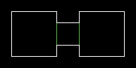

Типы лифтов.
============

Что такое лифты?
----------------

Лифт - когда активируется линия с типом лифта, пол сектора - лифта опускается вниз вплоть до высоты пола следующего близлежащего сектора. Короче, смотрим на рисунок слева. Там два больших сектора - слева (высота пола 0, высота потолка 128) и справа (высота пола 256, выстоа потолка 384) и один маленький сектор между ними (выста пола 256, потолка 384, таг 1). Если игрок появляется слева, значит ему нужно пройти вправо, и наоборот. Значит, линия слева, SR Lower Lift, Wait, Then Raise, линия справа - WR Lower Lift, Wait, Then Raise. Линия справа может глючить, когда лифт опускается. Это значит, что вы забыли поставить нижнюю текстуру(редактор говорит, что она не нужна. Она действительно не нужна, пока пол не опустится. Редактор ведь не может распознать это, так что будьте внимательны!).
Линии с типом лифта могу также быть на расстоянии от лифта. Можете поэксперементировать с тектурами и опциями Upper и LowerUnpeg.

Типы лифтов.
------------

.. list-table:: 
   :widths: 15 10 30
   :header-rows: 1

   * - Название
     - Номер
     - Описание
   * - Lower Lift, Wait, Then Raise
     - 10 / 21 / 62 / 88
     - Лифт опустится, через несколько секунд поднимется.
   * - Lower Lift Fast, Wait, Then Raise
     - 120 / 121 / 122 / 123
     - Лифт быстро опустится, через несколько секунд быстро поднимется.
