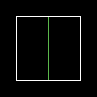

Регуляторы света.
=================

Что есть регуляторы света?
--------------------------

На рисунке сверху - 1 сектор и линия, разделяющая его на 2 части. Допустип, линия имеет один из типов регулятора. Когда игрок её пересекает, свет сектора сразу меняется.

Типы регуляторов света.
-----------------------

.. list-table:: 
   :widths: 15 10 30
   :header-rows: 1
   
   * - Название
     - Номер
     - Описание
   * - Light Level Match Brightest Adjacent
     - 12 / 80
     - Свет сектора становится равен свету соседнего сектора с наиболее высоким освещением.
   * - Light Level Match Dimmest Adjacent	
     - 104
     - Свет сектора становится равен свету соседнего сектора с наиболее низким освещением.
   * - Light ON
     - 13 / 81 / 138
     - Свет "включился" (текущий уровень света плавно переходит в 255).
   * - Light OFF
     - 35 / 79 / 139
     - Отключение света за неуплату :) (текущий уровень света плавно переходит в 0).
   * - Light Blink Start Every 1 Sec
     - 17
     - (Аналогично типу сектора 3) С момента активации яркость сектора будет изменятся каждую секунду.
