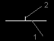
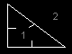
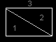
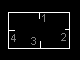

Основные понятия
================

.. ::

    Так из чего состоит уровень? Не буду углубляться в подробности как это всё записывается, просто расскажу то, что мы видим в редакторах.

Система координат, основные элементы
------------------------------------

Простая точка, она же вершина. Единственные её параметры - ''X'' и ''Y''. ''X'' и ''Y'' - координаты. Их можно назвать также длиной и шириной. Где же высота??? Вообще высота в DooM - понятие очень относительное. Как делать уровни обьёмными смотрите в разделе секторов.
Так на кой нам нужна эта точка? Для того, чтобы проводить линии.

Линия
-----

Линия - стена с двумя сторонами. Линии называют linedef, стороны - sidedef.

1 - собственно, сама линия. 2 - обозначение, указывает на первую сторону. Такое обозначение присутствует в большинстве редакторов.

Сектор
------

Сектор - набор линий. Минимум линий в секторе - 3, максимум вроде неограничен.

Так, теперь будем устранять кашу в вашей голове :). Линия может быть односторонней\двусторонней (two-sided) а также она может быть блокированной (impossible). Игрок, монстры, всё кроме крови и пуль не может пройти сквозь линию с флагом (флаг - опция) Impossible. Пространство за пределами всех секторов на вашей карте я называю пространством (логично :) ). На рисунке  1 - территория вне сектора, 2 - пространство. Запомните одно простое правило - игрок не должен заходить в пространство, во избежании ошибок и глюков, лучше, чтоб он всегда был на территории секторов.Два граничищих сектораНа рисунке слева 1 - сектор 1, 2 - сектор 2, 3 - пространство. Белые линии - линии с флагом impossible, чуть сероватая - без него. Белые линии сдесь граничат с пространством, серая - линия пересечения двух секторов.

ВНИМАНИЕ! Линии, граничищие с пространством ДОЛЖНЫ иметь флаги impassible и не иметь флаг two-sided. Они также не должны быть повёрнуты к пространтву первой стороной. Линии, не граничищие с пространством Должны иметь флаг two-sided. Правило выполняйте независимо от ситуации.
Линии, не граничищие с пространством могут иметь флаг impossible, а могут и не иметь (по вашему желанию). Граничищая линия обязана иметь.

Закрытые и незакрытые сектора
-----------------------------

Основная ошибка всех мапперов - оставляют незакрытыми сектора. Что значит незакрытый сектор? Допустим, здесь представлен закрытый сектор 0. У обоих сторон линии есть опция - сектор. То - есть, к какому сектору данная сторона относится. Эти линии граничат с пространством, у них нет вторых сторон. И все первые стороны этих линий прописаны к сектору 0. Сектор закрытый, если все стороны, обращённые к данному сектору к нему прописаны. На рисунке сектор 0. Если какая - нибудь сторона прописана к сектору, допустим, 1, то оба сектора будут незакрыты (минимум линий - 3, а в секторе 1, получается всего одна, а та сторона, которая теперь прописана к сектору 1, направлена на сектор 0). Если к одной из линий добавить вторую сторону и приписать к сектору 0, то сектор 0 будет незакрыт (вторая сторона направлена не на него). Если вторую сторону приписать к сектору 1, сектор 0 будет закрыт, а сектор 1 - нет (сектор 0 закрыт, так как все стороны, на него обращённые, к нему и приписаны. А у сектора 1 всего одна линия) Это далеко не все примеры, но я думаю, вы сами разберётесь и без меня. Для проверки ошибок на уровне, рекомендую редактор DeePSEA. Он скажет, где сектора незакрыты.

Свойства линии 
--------------

Здесь мы пока приведём только флаги. С другими свойствами познакомитесь попозже. Два основных свойства линни вы уже знайте - флаги Impossible и two-sided. Остальные:

.. list-table:: 
   :widths: 20 30
   :header-rows: 1
   
   * - Название
     - Описание
   * - Блок монстров (monsters block)
     - монстры не могут пройти через эту линию (аналогично Impossible, но только для монстров).
   * - Секрет (secret)
     - + 1 разгаданный секрет игроку когда он пересечёт эту линию.
   * - Блок звука (block sound)
     - если окружить сектор такими линиями, то монстры этого сектора не будут слышать стрельбу игрока (если он находится в другом секторе).
   * - Невидимая (Invisible)
     - никогда не появится на карте (пока игрок не возьмёт электронную карту).
   * - Всегда на карте (Auto - mapped)
     - сразу появляется на карте.

Другие свойства линии и свойства секторов в следующей теме.
