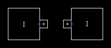

Спец. типы (телепортеры, выходы).
=================================

Телепортеры.
------------

Вершины соединяют линии сектора между собой.

Вот подошди мы к заключительной нлаве первой части "думы об оригинальной думы" :). Обьясняю теперь последнии типы линий. Смотрим на рисунок справа. Есть 3 сектора. Сектор 1 (его две комнаты помечены I) - высота пола 0, высота потолка 256. Рассматривать мы будем два оставшихся маленьких сектора. тот, что слева имеет таг 1, тот что справа - таг 2. Это и есть телепортеры. Для красоты лучше ставить высоту не более 128, освещение поярче и ставить текстуры пиктограмм полу и потолку. Сектора имеют линии с одинаковым типом WR Teleport To Tagged Sector. Причём у левой линии таг 2 (телепортирует в сектор с тагом 2), а у правой - наоборот (таг 1). Сектора куда телепортируется игрок, должны иметь обьект "teleport landing" (отмечены на рисунке жёлтыми крестиками). При телепортации игрок получает координаты и угол такого обьекта. При этом, игрок телепортируется только когда пересекает первую сторону, пересекая вторую, он телепортироваться не будет. При построении уровней надо это учитывать (на рисунке изображены первые стороны).

На рисунке - пример двустороннего телепорта - игрок заходит в первый телепорт, выходит из второго, делает что нужно, заходит обратно во второй и выходит в первый. Есть односторонний телепорт - игрок заходит в первый, выходит во второй. Но повторно зайдя во второй телепорт, он не попадает в первый. Вот так вот. (на рисунке сверху слева изображён готовый телепорт.

Телепортация монстров. С таким мы сталкивались на одном из уровней в DooM 2. Вот лезем мы на столб, берём ключ, а тут монстры появляются из ниоткуда. Как такое сделать? Просто. Смотрим на рисунок слева. Сектор I - там появляется игрок. Далее, он стреляет в кого - то (в монстров, например), чтоб идти не мешали. А "телепортационные монстры" из сектора II его стрельбу услышали (звук проходит через сектор IV). Сектор IV надо маскировать, высота его потолка не должна равняться высоте пола, на линиях в этом уровне не должен стоять флаг Block Sound. Сектор III - закрытая (не до конца) дверь. Высоты пола и потлка этого сектора также не должны быть равными, но и не должны быть очень большими в разнице (монсры пройдут преждевременно). Синие линии - телепортационные (как только монстры их пересекут, они телепортируются в сектор I, к игроку). Дальше игрок натыкается на триггер (сдесь - рубильник - зелёная линия). Дверь IV открывается, монстры пересекают синие линии и благополучно телепортируются в сектор I. Всё.

Спец. типы.
-----------

.. list-table:: 
   :widths: 15 10 30
   :header-rows: 1
   
   * - Название
     - Номер
     - Описание
   * - Teleport To Tagged Sector With TeleThing
     - 39 / 97
     - Телепортировать кого - нибудь в нужный сектор.
   * - Monster Teleport To Tagged Sector With TeleThing
     - 125 / 126
     - Телепортировать монстра в нужный сектор.
   * - Scroll Wall Left
     - 48
     - Тага не нужно. У линии с таким типом, текстура становится двигающийся (движется влево, медленно).
   * - End Level Go To Next Level
     - 11 / 52
     - Когда кто - то активирует такую линию, уровень заканчивается, далее происходит процесс перенесения на сдледующий (картинка такая, подстчитывают убитых и т. д.).
   * - End Level Go To Secret Level
     - 51 / 124
     - То - же самое, что и предыдущее, только игрока выбрасывает на секретный уровень. Вот так на некоторых уровнях делают по 2 выхода, 1 - обычный, второй - сектретный.
