Высота. Текстуры. "Эффект лесницы"
==================================

Высота сектора. Текстуры
------------------------

Одним из свойств сектора является высота. Высота в DooM - понятие относительное. В игре она есть, а карта всего двухмерная. Сейчас расскажем об этом явлении.
Вы можете настроить высоту пола и потолка. Можно ставить как положительное, так и отрицательное значение. Но ВНИМАНИЕ!!! Высота пола может быть равна высоте потолка, но высота пола не должна превышать высоту потолка!
Вспомним теперь предыдущию главу. Есть два сектора с общей линией. Что будет, если у этих секторов будет разная высота? 

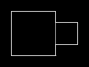

Это скриншот из редактора.

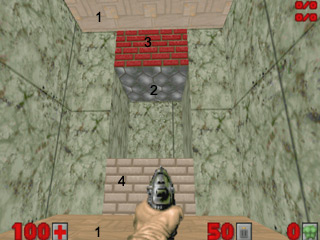

А вот так это выглядит в игре. Есть сектор 1 (на рисунке его пол и потолок обозначены 1) с высотой потолка 128 и пола -128. Есть сектор 2 (его потолок обозначен 2) с высотой потолка 64 и пола -64. О вторых этажах и речи нет!(пока).

Ещё 2 свойства секторов - текстуры пола и потолка. Есть уникальная текстура - F_SKY1, тогда потолок (или пол - куда поставите) становится невидимым, сквозь него видно небо.
У сторон есть аналогичные свойства - верхняя текстура(на рисунке - 3), средняя(на рисунке невидима) и нижняя (на рисунке - 4). На рисунке мы поставили только верхнюю и нижнюю, потому что если есть разница в высоте, то обязаны быть в тех местах и текстуры. Текстура должна быть на той стороне, что "смотрит" на эту разницу. Другой стороне текстура не нужна. Верхняя текстура нужна, если есть разница в высоте сверху, нижняя - снизу, средняя находится между полом и потолком. Ещё одно правило - средняя текструа линий, граничащих с пространством обязана быть. Если линия не граничит с пространством, то средняя текстура не обязательна.
Зададим общей линии двух секторов среднюю текстуру, но с одной стороны.

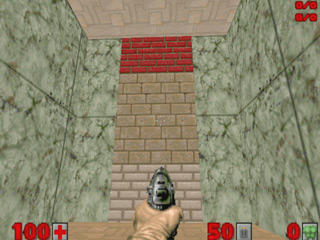

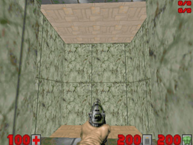

Итак, на рисунке мы видим среднюю текстуру. Так как линия не имеет флаг Impossible, я запрыгнул туда. Посмотрите на рисунок справа. А где текстура? А текстура только с той стороны, сдесь мы текстуру не прописывали. Вот так делают "нычки" в deathmatch. Игрок с одной стороны не видит другого с другой стороны, а другой игрок видит первого. И легко убивает, пока первый пытается понять откуда идут выстрелы (не раз этим пользовался :) ).

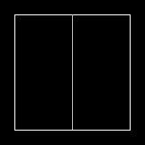

Теперь нарисуем сектор побольше. Вот такой. Высота потолка 256 (если я не указываю высоту пола или потолка, значит она равна 0). Это не 2 сектора, - это 1 сектор с обычной линией, проведённой в середине. Теперь поставим на эту линии с обоих сторон текстуру высотой 128.

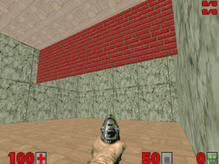

На рисунке это красная текстура. Но что такое? Она ж висит! Не размножается по вертикали. Запоминайте: если у текстуры есть флаг two-sided, значит текстура не будет размножаться, если флага нет, то будет. Собственно two-sided не должен стоять только на линиях, граничищих с пространством. Все линии с зелёными текстурами граничат с пространством, флаг two-sided не имеют и поэтому их текстура размножается. Нижняя и верхняя текстуры размножаются всегда. Можно "прикрутить" тектуру к полу, поставив для линии флаг LowerUnpeg.
Ещё у сторон есть свойства - ''x'' и ''y''. Задаётся ''x'' и ''y'' текстур (не могу обьяснить нормально, сами разберётесь).

"Эффект лестницы"
-----------------

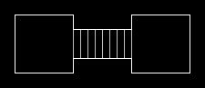

Сделаем несколько секторов разной высоты.
Справа налево сектора набирают высоту пола по 16. Высота потолка у всех 256.

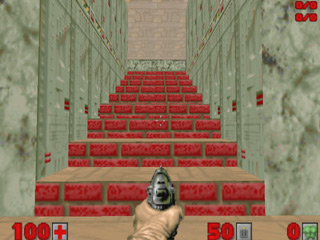

Если разница в высоте пола секторов составляет 24 или ниже, то появляется "эффект лестницы". Игрок и монстры могут подниматься и спускаться по ним. Если высота больше 24, то игрок не сможет забираться на них, а спрыгивать будет с характерным звуком. Монстры по умолчанию спрыгивать не будут.

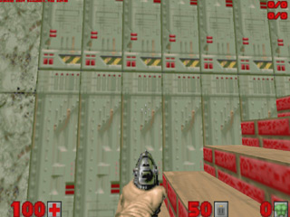

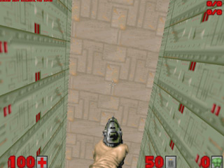

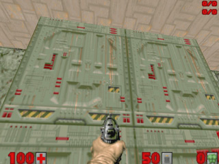

Сверху 3 скриншота. Посмотрите на первый. Текстуры выглядят ужасно. Просто когда заканчивается линия, заканчивается и текстура, когда начинается другая линия, начинается новая текстура. Посмотрите на скриншот 2. У потолка и у пола нет такого эффекта. Какие бы выкрутасы вы не проделывали с секторами, текстуры пола и потолка будут выглядеть нормально. Посмотрите на скриншот 3. Там я немного подредактировал x и y текстур, получилось всё нормально. Первую линию я не трогал. У второй линии сдвинул текстуру на длину x, равную длине предыдущих линий(пока была только 1 линия длиной в 32). Затем сделал тоже самое с третьей(было уже 2 предыдущих линии по 32, итого 64) и четвёртой. Тут текстура, равная по длине 128 и растянутая на 4 линии по 32, закончилась. Началась новая, линию 5 не трогал, с линией 6 сделал тоже, что и с линией 2, с линией 7 то же, что с линией 3 и т. д.
