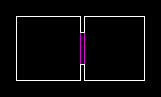
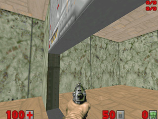
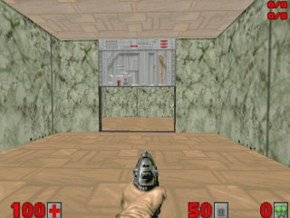
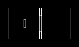

Что такое "таги"? Типы дверей
=============================

Что такое таги?
---------------

Таг - это одно из свойств секторов и линий, что связывает их вместе. То есть при активации линии определённонго типа, таг указывает, какой сектор (или несколько) будет совершать действие.

Типы типов линий ;) (надо ж такое написать...).
-----------------------------------------------

Вообщем название типа выглядит так: XY ТИП. X может быть буквами W, S, G или D. Y может быть 1, R или M. Щас всё обьясню. (D смотрите в заголовке "Двери").

.. list-table:: 
   :widths: 15 30
   :header-rows: 1
   
   * - Название
     - Описание
   * - WY
     - Линия будет активирована, когда игрок через неё "переступит".
   * - SY
     - Линия будет активирована, когда игрок её нажмёт.
   * - GY
     - Линия будет активирована, когда игрок будет в неё стрелять.
   * - X1
     - Линия может быть активирована только 1 раз.
   * - XR
     - Линия может быть активирована сколько угодно раз.
   * - XY (mon)
     - Только монстр может активировать данную линию.

Двери.
------

Что такое двери? Это когда мы подходим к стене, нажимаем use и стена двигается вверх. Как это делать?
Есть два сектора. Первый - маленький, ограждён двумя фиолетовыми линиями (линии должны быть повёрнуты к сектору вторыми сторонами!). Высота пола и потолка одинакова - 0. Это и есть дверь. Второй сектор - это 2 большие комнаты (в одном секторе может быть сколько угодно комнат и они могут находиться сколько угодно далеко друг от друга). Когда мы нажимаем на одну из двух линий, то потолок сектора перемещается вверх, таща за собой текстуру. Так вот, к двум линиям фиолетовым "прикручен" таг DR Open Door Wait/Close. D значит дверь - то есть эта линия не требует тага, мы можем открыть и закрыть дверь в любое время. R - мы можем открывать/закрывать дверь сколько угодно раз. Open Door Wait/Close - открыть дверь (используется когда дверь закрыта, то есть высота пола и потолка 0).

Обратите внимание, на то, что боковая текстура выезжает вверх, вместе с потолком. Для красоты боковым линиям советую ставить флаг LowerUnpegged.

Ух ты... Добавив таг UpperUnpegged, текстура "открутится" от потолка. Можно также добавить таг LowerUnpeg к лифтам, такой же эффект будет.

Двери могут открываться и на дистанции. Для этого надо сообщить открывающей линии таг сектора, который является дверью. Короче, им надо задать один и тот - же таг, отличный от нуля. Смотрите на рисунок слева. Для красоты нарисуем маленький сектор внутри большого. высота потолка 128, высота пола 72. Есть открывающая линия - таг 1, тип - SR Open Door, Wait, Then Close. Теперь, нажимая на эту линию откроется дверь с тагом 1.
Существуют такие текстуры, называются swithes (рубильники). Нажимаешь на такую текстуру и она меняет своё изображение. В оригинале так сделаны всякого рода кнопки и рубильники. Если тип линии XY = SR, то тогда изображение меняется лишь на пару секунд, затем возвращается. Если тип S1, то изображение меняется 1 раз и не возвращается в исходное.

Типы дверей
-----------

Здесь я буду опускать часть XY. Только "основу" номер и описание.
     
.. list-table:: 
   :widths: 15 10 30
   :header-rows: 1
   
   * - Название
     - Номер
     - Описание
   * - Open Door, Wait, Then Close
     - 1 / 4 / 29 / 63 / 90
     - Дверь открывается, через пару секунд закрывается.
   * - Open Door, Stay Open
     - 2 / 31 / 46 / 61 / 86 / 103
     - Дверь открывается и не закрывается.
   * - Open Door Fast, Wait, Then Close
     - 105 / 108 / 111 / 114 / 117
     - Дверь быстро открывается, через пару секунд быстро закрывается.
   * - Open Door Fast, Stay Open
     - 106 / 109 / 112 / 115 / 118
     - Дверь быстро открывается и не закрывается.
   * - Close Door
     - 3 / 42 / 50 / 75
     - Дверь закрывается.
   * - Close Door Fast
     - 107 / 110 / 113 / 116
     - Дверь закрывается быстро.
   * - Close Door, wait 30, Then Open
     - 16 / 76
     - Дверь закрывается, через 30 секунд открывается.
   * - Open Door Blue, Wait, Then Close
     - 26
     - Дверь открывается синим ключом, через пару секунд закрывается.
   * - Open Door Yellow, Wait, Then Close
     - 27
     - Дверь открывается жёлтым ключом, через пару секунд закрывается.
   * - Open Door Red, Wait, Then Close
     - 28
     - Дверь открывается красным ключом, через пару секунд закрывается.
   * - Open Door Blue, Stay Open
     - 32
     - Дверь открывается синим ключом и не закрывается.
   * - -Open Door Yellow, Stay Open
     - 34
     - Дверь открывается жёлтым ключом и не закрывается.
   * - Open Door Blue Fast, Stay Open
     - 99 / 133
     - Дверь открывается синим ключом быстро и не закрывается.
   * - Open Door Yellow Fast, Stay Open
     - 136 / 137
     - Дверь открывается жёлтым ключом быстро и не закрывается.
   * - Open Door Red Fast, Wait, Stay Open
     - 134 / 135
     - Дверь открывается красным ключом быстро и не закрывается.
