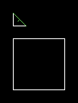
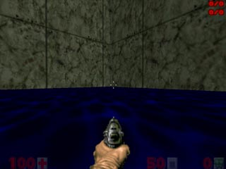
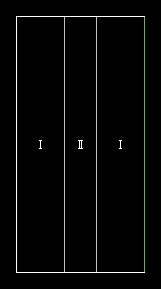
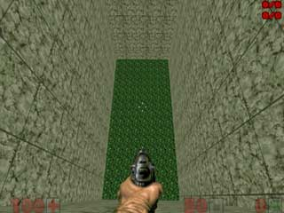

Остальное.
==========

Телепортеры.
------------

2 новых вида телепортеров. Тихий телепортер - без зелёной вспышки и без звука. Телепорт класса линия - линия: телепорт, не требующий специального обьекта в секторе. Делается это так: необходимо 2 линии с одинаковым тагом и типом телепорта линия - линия. В итоге, активируя такую линию, ты телепортируешься на другую линию с таким же тагом и типом. Угол будет равен углу первой стороны линии. Есть обратные телепорты, когда угол будет равен противоположному.

Свет.
-----

Есть несколько новых видов регуляторов света. Все называть не буду, отмечу только 2 - осветить пол и осветить потолок. Это значит, что яркость пола или потолка, не зависимо от яркости сектора, в котором они расположены, будет иметь яркость того сектора, в котором назодится триггер.

Голограмма.
-----------

Голограммой данную вещь я назвал сам не зная почему :). Эта фича добавляет ещё пару текстур пола и потолка в один сектор!. Я так и не изучил все свойства данной фичи, так что расскажу про 2 случая, где её применяют.

На рисунке слева вы видите, что игрок стоит по пояс в воде. То есть, не прямо на текстуре, он как бы, провалился в неё. Вот такая вода в BooM. На рисунке справа: большой сектор (там где вода) и маленький (там где зелёный триггер). Большой сектор: высота пола 0, потолка 256. Маленький: высота пола 32, потолка 256, текстура пола - вода. Так это и делается.

Вот это - один из вариантов невидимого моста. На рисунке слева - I - сектор с триггером, II - сектор с мостом. Сектор I: высота пола -1024, высота потолка 1024, текстура пола - радиация, текстура потолка - небо. Сектор II: высота пола 0, высота потолка 1024, текстура пола - радиация, текстура потолка - небо.

Вот вам и мост над пропастью.

Остальные типы.
---------------

.. list-table:: 
   :widths: 15 10 30
   :header-rows: 1
   
   * - Название
     - Номер
     - Описание
   * - Silent Teleport To A Teleport Thing
     - 207 / 208 / 209 / 210
     - Тихий телепорт
   * - Silent Teleport To A Line With The Same Tag
     - 243 / 244
     - Тихий телепорт класса линия - линия
   * - Silent Teleport To A Line With The Same Tag, Reversed
     - 262 / 263
     - Двигать обьекты, стоящие на полу
   * - Silent Teleport Monster Only To A Teleport Thing
     - 268 / 269
     - Тихий телепорт монстров
   * - Silent Teleport Monster Only To A Line With The Same Tag
     - 266 / 267
     - Тихий телепорт монстров класса линия - линия
   * - Silent Teleport Monster Only To A Line With The Same Tag, Reversed
     - 264 / 265
     - Тихий телепорт монстров класса линия - линия, обратный
   * - Set Tagged Sector's Floor Light Level
     - 213
     - Сделать яркость пола равной яркости сектора, где расположен триггер
   * - Set Tagged Sector's Ceiling Light Level
     - 261
     - Сделать яркость потолка равной яркости сектора, где расположен триггер
   * - Make Tagged Walls Tranclusent
     - 260
     - Сделать все линии с таким же тагом прозрачными. Если таг 0, то сделать прозрачной эту линию
   * - Make Fake Ceiling And Floor
     - 242
     - Сделать голограмму в секторе.
