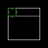
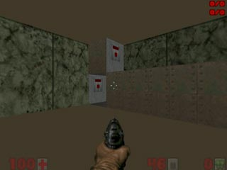
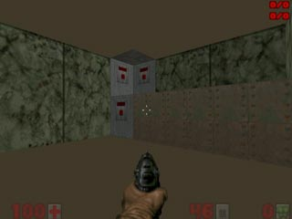

Платформы, элеваторы.
=====================

Есть ещё линии, которых нет в BooM LineDef Menu. Вы их сами найдёте и уже разберётесь. Я расскажу только о двух видах - платформы и элеваторы.

Платформы
---------

Очень простая вещь. Активированная платформа - как лифт: пол поднимается, через 3 секунды опускается, потм, через 3 секунды опять поднимается, и т. д.
К платформам также относится следующая фича: представьте такое: бежит герой наш, бежит, видит надпись выход. Он бежи на неё, и тут БАЦ! Из неоткуда на твоём пути появляется стена... Такое возможно вот как: есть такой тип линий - активируешь его - высота пола становится равной высоте потолка. То есть, пол придвигается к потолку мгновенно. Активируешь линию опять, пол мгновенно возвращается к прежней высоте.

Элеваторы
---------

Элеватор - когда пол и потолок двигаются одновременно в одном и том же направлении. На рисунке спра смотрите, как это работает. Есть правая, левая, верхняя и нижняя линии. 

Игрок в элеваторе нажимает на верхнюю линию и пол вместе с потолком поднимается. Нажимает линию слева - опускается. А если игрок остался на верху, а лифт ушёл вниз? Для этого есть кнопка на правой линии, он нажимает её, лифт поднимается. А если наоборот, лифт ушёл вверх, а вы внизу? Для этого есть нижняя линия. Вот так - главное ничего не забыть и просчитать все варианты ситуаций.

Типы платформ и элеваторов.
---------------------------

.. table:: 

    +------------------------+--------------------+----------------------------------------+
    | Название               |        Номер       |                  Описание              |
    +========================+====================+========================================+
    | Start Moving Platform  |      162 / 181     | Начать движение платформы.             |
    +------------------------+--------------------+----------------------------------------+
    | Stop Moving Platform   |      163 / 182     | Остановить платформу.                  |
    +------------------------+--------------------+----------------------------------------+
    | Toogle Floor Between   |                    | Мгновенно придвинуть пол к потолку     |
    | Ceiling And Floor      |      211 / 212     | или обратно.                           |
    | Instantly              |                    |                                        |
    +------------------------+--------------------+----------------------------------------+
    | Elevator To Next       |      227 / 228 /   | Двигать пол (вместе с потолком)        |
    | Highest Floor          |      229 / 230     | на высоту следующего (по высоте) пола. |
    +------------------------+--------------------+----------------------------------------+
    | Elevator To Lowest     |      231 / 232 /   | Двигать пол (вместе с потолком) на     |
    | Highest Floor          |      233 / 234     | высоту следующего нижнего пола.        |
    +------------------------+--------------------+----------------------------------------+
    | Elevator To            |      235 / 236 /   | Двигать пол (вместе с потолком) на     |
    | Current Floor          |      237 / 238     | высоту пола сектора, где расположен    |
    |                        |                    | триггер.                               |
    +------------------------+--------------------+----------------------------------------+
