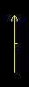
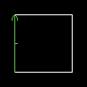
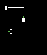

Векторы.
========

Что такое векторы? Из курса геометрии и алгебры класса примерно девятого, узнаём, что векторы - отрезки, имеющие направление. Так и сдесь. Любая линия сдесь - вектор, так как имеет направление. Направление зависит от первой стороны. На рисунке вы видите эту зависимость.

Простые векторы.
----------------

Эту тему сначала хотел назвать "простые движения" :). Ну ладно, дело у нас нешуточное: щас будем двигать текстуры пола и потолка.
Сдесь мы видим вектор, имеющий тип "Scroll Tagged Floor". Это значит, что пол движется в том же направление, что и вектор. Скорость движения зависит от длины вектора, она будет в 32 раза меньше длины вектора. С таким же успехом можно двигать и текстуру стены. Если вектор будет параллелен линии, то текстура будет двигаться горизонтально, если перпендикулярен, то вертикально. Если он будет под непонятным углом, то и то, и другое сразу. Сектор/линия не могут иметь более одного двигающего вектора.

Комплексные векторы.
--------------------

Существуют сложные векторы. Они реагируют на изменение высоты сектора, в котором находяться (высота сдесь - расстояние между полом и потолком). Скорость движения текстуры сдесь равна длине вектора, делённая на 32 и умноженная на разницу в высоте сектора. То есть конечная высота минус начальная. Значит, если изменения нет, разница равна нулю, то и скорость равна 0. Если разница = 1, то скорость равна длине вектора, делённой на 32. Если изменение больше 1, то скорость равна длине вектора, делённой на 32 и умноженной на разницу. Если же высота сектора стала уменьшаться, то следовательно, скорость по направлению будет противоположной направлению вектора. Если пол (или потолок) поменял высоту мгновенно, то и скорость изменилась мгновенно. Если же пол или потолок двигаются медленно, на большое расстояние, то и скорость будет изменяться плавно. Также точно ведёт себя и текстура стены. Сектор/линия не могут иметь более одного двигающего вектора.
Ещё один вид векторов - ускоряющие векторы. Они действуют как предыдущие: реагируют на высоту. На рисунке слева: два сектора - большой и маленький. В маленьком секторе тоже 3 линии, только линия, отмеченная II равна 4. То есть, скорость такого вектора равна 1/8. Зачем так жестоко? Щас обьясню. I - простой двигающий вектор. Длина равна 256, скорость текстуры = 8. II - сложный ускоряющий сектор. III - нацелен на маленький сектор, придвигает пол к потолку (мы тем самым меняем высоту пола в секторе и активируем ускоритель). Чем отличаются двигающий и ускоряющий сектора? Сектор может иметь только 1 двигающий вектор, но бесконечное множество ускорителей. Тем самым все эти вектора суммируются, ускоряя, замедляя, подавляя друг друга. Очень рекомендую почитать вам у суммировании векторов, я всего сам обьяснить не смогу. А в остальном ускорители - это те же комплексные движущие векторы.
Теперь вы можете делать конвееры, а если очень посторайтесь, то и регулятор скорости конвееров!

Ветер. Течение. Трение.
-----------------------

Течение. Помните, играя в Еретика или Хексена, вы сталкивались с водой, которая уносила вас за собой. Вот такой эффект и есть течение. Чем же он тогда отличается от двигающих и ускоряющих векторов, способных перемещать предметы? Когда тебя двигают те векторы, игрок почему - то плавно "врыгает" вверх - вниз, создаётся впечатление, что это ты сам идёшь, а не пол тебя тащит. У течения такого эффекта нет.
Ветер. Чем отличается течение от ветра? При течении ты можешь прыгнуть и "оторваться" от пола, пока ты в воздухе, течение не оказывает воздействия на тебя. Ветер - наоборот. Пока ты стоишь на полу, ветер не так сильно двигает тебя. Если ты прыгнешь, то ветер будет действовать на тебя в несколько раз сильнее.
В BooM ввели обьекты контроля ветра. Есть два типа обьекта: 1)Всё притягивает к себе со всех сторон, 2) всё отталкивает от себя. А так это - тот же ветер. Делается такой эффект так: есть линия со специальным типом и тагом. В сеторе, где должен быть такой ветер, должен быть один из этих двух обьектов, а сектор должен иметь тот - же таг. Полученный ветер не будет зависить от направления вектора, только от длинны.
Трение. Как получается эффект льда? Путём уменьшения силы трения. Есть вектор с нужным типом и тагом. Трение не зависит от направления вектора. Чем больше длина вектора, тем меньше сила трения. Если длина вектора больше 100, то тогда получается эффект льда (повышение скорости и понижение торможения), если меньше 100, то эффект "густой грязи" - понижение скорости и повышение торможения. Как мы помним, если игрок разгонится, а потом отпустит кнопку бега, он остановится не сразу, а немного поскользит по инерции. В BooM мы можем тем самым это скольжение замедлить или ускорить.
В BooM есть ещё и BooM Sector Type Menu. Для того, что бы активировать ветер/течение/трение надо выбрать соответствующую опцию в этом меню. Ну вы уже разберётесь сами.

Типы векторов.
--------------

.. list-table:: 
   :widths: 15 10 30
   :header-rows: 1
   
   * - Название
     - Номер
     - Описание
   * - Scroll Tagged Ceiling
     - 250
     - Двигать текстуру потолка
   * - Scroll Tagged Floor
     - 251
     - Двигать текстуру пола.
   * - Scroll Objects On Tagged Floor
     - 252
     - Двигать обьекты, стоящие на полу
   * - Scroll Tagged Floor And Objects
     - 253
     - Двигать текстуру пола и обьекты, стоящие на полу
   * - Scroll Tagged Wall
     - 254
     - Двигать текстуру стены
   * - Scroll Tagged Ceiling wrt 1st Side's Sector
     - 245
     - Двигать текстуру потолка (комплексный вектор)
   * - Scroll Tagged Floor wrt 1st Side's Sector
     - 246
     - Двигать текстуру пола (комплексный вектор)
   * - Scroll Objects On Tagged Floor wrt 1st Side's Sector	
     - 247
     - Двигать обьекты, стоящие на полу (комплексный вектор)
   * - Scroll Tagged Floor And Objects wrt 1st Side's Sector
     - 248
     - Двигать текстуру пола и обьекты, стоящие на полу (комплексный вектор)
   * - Scroll Tagged Wall wrt 1st Side's Sector
     - 249
     - Двигать текстуру стены (комплексный вектор)
   * - Accelerate Tagged Ceiling
     - 214
     - Двигать текстуру потолка (ускоряющий вектор)
   * - Accelerate Tagged Floor
     - 215
     - Двигать текстуру пола (ускоряющий вектор)
   * - Accelerate Objects On Tagged Floor
     - 216
     - Двигать обьекты, стоящие на полу (ускоряющий вектор)
   * - Accelerate Tagged Floor And Objects
     - 217
     - Двигать текстуру пола и обьекты, стоящие на полу (ускоряющий вектор)
   * - Accelerate Tagged Wall
     - 218
     - Двигать текстуру стены (ускоряющий вектор)
   * - Set Friction In Tagged Sector
     - 223
     - Изменить силу трения в секторе
   * - Set Wind In Tagged Sector
     - 224
     - Создать ветер в секторе
   * - Set Current Force In Tagged Sector
     - 225
     - Создать течение в секторе
   * - Set Point Of Push/Pull Field In Tagged Sector
     - 226
     - Создать ветер в секторе, используя специальные обьекты.
