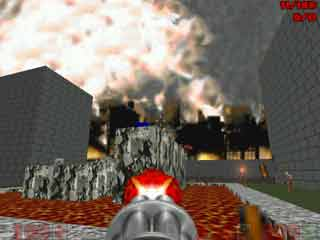

Примеры применения фич Dehacked
===============================
 
Здесь вы можете поиграть и посмотреть в то, что я сделал.

Deh
---

:download:`dehacked_00.deh` - это файл, заменяющий большинство монстров на маринов. Без замены кодепоинтеров.
:download:`dehacked_01.deh` - это файл, заменяющий оружия и пару монстров. С заменой кодепоинтеров.

Wad
---

Можно файлы deh добавлять в вад, как ламп dehacked. Тогда Legacy будет воспринимать их как Dehacked.

:download:`dehacked_02.WAD` - это мой старый файл, добавляющий гильзы к оружиям и монстрам. С заменой кодепоинтеров.

:download:`dehacked_03.WAD` - это файл, демонстрирующий динамический свет в Legacy.
