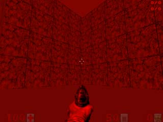

Световые карты. Прозрачные линии.
=================================

Световые карты (colormap), точнее удобность их использования - одно из величайших фич Legacy. Следует отметить, что уровень с такими картами будет тормозить на software, поэтому рекомендую включать Opengl.
Прозрачные линии - тоже неплохи. Там есть 6 разных видов таких линий. Но над ними надо ещё поработать создателям. Я пока заметил один лишь глюк - за такими линиями исчезают предметы (они есть, но через линию их не видно).

Световые мосты.
---------------

Всё, что попадает в зону действия световой карты - текстуры, спрайты - всё окрашивается в оттенок этой карты (как на рисунке). Делать такое, как я сказал выше, чрезвычайно просто, в отличие от BooM (и, возможно, от zdoom), там, насколько я знаю, световые карты, нужно создавать самому. А сдесь так: нужна линия с типом и тагом к определённому сектору, сгодится даже линия того же самого сектора. Надо задать её верхнюю текстуру типа "#RRGGBBX". # - Означает, что это не текстура, а код световой карты, RRGGBB - оттенок формата RGB, цифры формата hex, от 00 до ff (так задают цвета, например, в html), X - буква латинского алфавита, от A до Z, характеризует "силу" световой карты, насколько она яркая (на рисунке я делал z, карта с буквой a почти незаметна). Например, если я напишу #FF0000M, то световая карта будет иметь красный оттенок и среднюю силу.

Прозрачные линии.
-----------------

Ну, что такое прозрачные линии, я, думаю, вы догадаетесь сами. Есть несколько типов прозрачности, и, думаю, вам будет лучше самим разобраться в этом.

Типы световых карт и прозрачных линий.
--------------------------------------

.. list-table:: 
   :widths: 15 10 30
   :header-rows: 1
   
   * - Название
     - Номер
     - Описание
   * - Set Colormap To tagged Sector	
     - 282
     - Создать световую карту в секторе
   * - Make This Line Tranclucent
     - 284 / 285 / 286 / 287 / 288 / 260
     - Сделать прозрачной данную линию. Разные номера ставят прозрачность по разному. Номер 260 - выборачная прозрачность - прозрачны только несколько цветов. Но как их выбирать, я так и не понял
   * - Set Vertical Wind Force Up
     - 294
     - Создать в секторе ветер, дующий вверх
   * - Set Vertical Wind Force Down
     - 295
     - Создать в секторе ветер, дующий вниз
