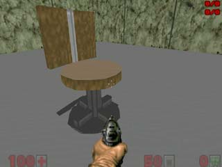
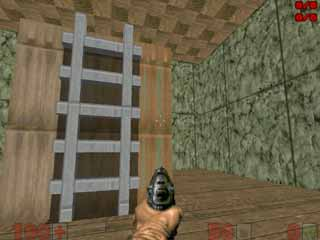
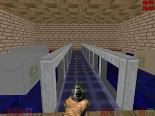

Примеры использования данных фич.
=================================

Для чего нужны 3d полы? Только для нескольких этажей в одном секторе? Ошибаетесь. С помощью 3d блоков можно сделать очень много разных вещей! Да и 3d воду можно использовать не только в качестве воды. Смотрите сами. Данные примеры также содержат готовые wad файлы, чтобы вы сами смогли посмотреть это в игре. файл "map_legacy_00.wad" содержит полностью прозрачную текстуру "emty". Остальные 3 файла - уровни. Запускать надо 2 файла вместе: "map_legacy_00.wad" и любой из трёх других.

:download: map_legacy_00.WAD

Мебель.
-------

Из 3d полов можно собирать 3d мебель. Это - стул.

:download: map_legacy_01.WAD

Лестница.
---------

Из 3d полов и воды можно собрать лестницу, по которой можно подниматься!

:download: map_legacy_02.WAD

Стиль Quake 2.
--------------

Вот такой стиль уровней - вода с плавающими ящиками, напоминает почему - то мне Quake 2. Данный уровень показывает, как делать воду со световой картой, прозрачный 3d пол, вообщем, смотрите сами.

:download: map_legacy_03.WAD
